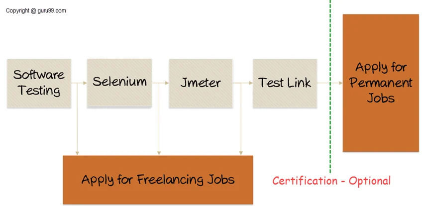

[← Back to Home](../index.md)

---

# Day 1 - Software Testing Fundamentals 🧪

## Overview

Today I started my QA learning journey by exploring the foundations of Software Testing.

### Main Topics Covered

* What Software Testing is
* Why testing is important
* Types of testing
* Levels of testing
* The role of a Software Tester
* Skills required in QA
* QA vs QC
* Roadmap to becoming a Software Tester

---

## 🔍 What is Software Testing?

Software Testing is the process of verifying and validating software to ensure it meets requirements and behaves as expected.

### Main Objectives

* Identify defects and bugs
* Verify requirements
* Improve software quality
* Increase customer satisfaction
* Reduce business risks

### Why is it Important?

Testing helps organizations:

* Save money by finding defects early
* Improve security
* Increase reliability
* Deliver better user experiences

---

## 🧪 Types of Software Testing

| Type                   | Purpose                                             |
| ---------------------- | --------------------------------------------------- |
| Functional Testing     | Verifies what the system does                       |
| Non-Functional Testing | Verifies how well the system performs               |
| Maintenance Testing    | Ensures changes do not break existing functionality |

### Functional Testing

Examples:

* Login
* Registration
* Password Reset

### Non-Functional Testing

Focuses on:

* Performance
* Security
* Usability
* Reliability

### Maintenance Testing

Example:

* Regression Testing

---

## 🏗️ Levels of Testing

### Unit Testing

Tests individual components in isolation.

### Integration Testing

Tests communication between modules.

### System Testing

Tests the complete application as a whole.

### Acceptance Testing

Validates that the product meets business and user requirements.

---

## 👨‍💻 Who is a Software Tester?

A Software Tester is responsible for evaluating software quality by identifying defects and verifying requirements.

### Common Responsibilities

* Analyze requirements
* Create test cases
* Execute tests
* Report defects
* Retest bug fixes
* Collaborate with developers

---

## 🛠️ Skills Required

### Technical Skills

* Software Testing Fundamentals
* Test Case Design
* Bug Reporting
* SQL Basics
* Linux Basics
* API Testing
* Automation Tools
* Test Management Tools

### Soft Skills

* Analytical Thinking
* Communication
* Curiosity
* Attention to Detail
* Time Management
* Problem Solving

---

## ⚖️ QA vs QC

| Quality Assurance (QA) | Quality Control (QC) |
| ---------------------- | -------------------- |
| Process-oriented       | Product-oriented     |
| Preventive             | Corrective           |
| Focuses on prevention  | Focuses on detection |
| Improves processes     | Finds defects        |

### Simple Explanation

QA aims to prevent defects.

QC aims to detect defects.

Software Testing is considered part of QC.

---

## 🗺️ Roadmap: How to Become a Software Tester



```text
Software Testing Fundamentals
        ↓
QA Concepts
        ↓
Test Cases & Bug Reporting
        ↓
SQL & Linux
        ↓
API Testing (Postman)
        ↓
Automation Testing (Selenium)
        ↓
Performance Testing (JMeter)
        ↓
Test Management Tools
        ↓
Practice Projects
        ↓
Portfolio & Jobs
```

### Optional Certifications

* ISTQB Foundation Level

---

## ✨ Key Takeaways

1. Testing identifies defects and gaps.
2. Early testing reduces costs.
3. Quality impacts security and user trust.
4. QA prevents defects while QC detects them.
5. Testers need both technical and soft skills.
6. Testing is a collaborative activity.
7. Software quality is everyone's responsibility.

---

## 💭 Personal Reflection

As a Front-End Developer, I usually focus on building features and making them work.

Today's lesson introduced a different perspective: thinking about how software can fail, how users might interact with it, and how quality can be improved before defects reach production.

This mindset shift from **building** to **validating quality** is one of the most valuable lessons from Day 1.

---

### Challenge Progress

**Challenge:** 30-Day QA Learning Challenge

**Day Completed:** Day 1 ✅

---

[← Back to Home](../index.md) | [Next: Day 2 →](./02-testing-principles-v-model.md)
