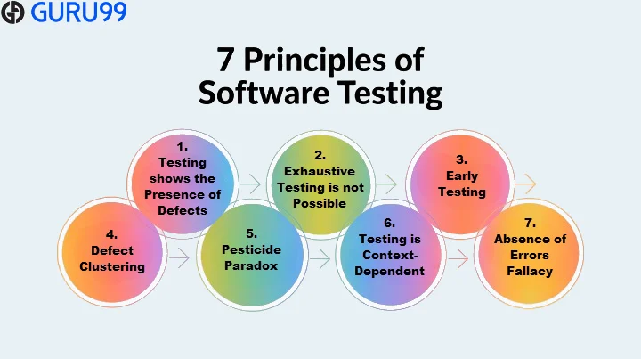
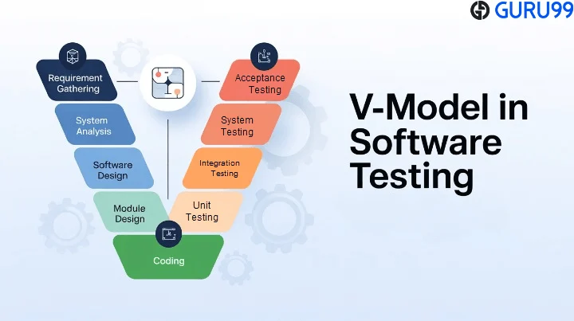

# ☕Day 2 - The 7 Principles & The V-Model 

## 📚 Topics Covered

Today I studied two fundamental concepts in Software Testing:

1. **The 7 Principles of Software Testing**
2. **The V-Model (Verification & Validation)**

---

# 🎯 The 7 Principles of Software Testing

The 7 Principles, promoted by ISTQB, serve as essential guidelines for every QA professional.

---

## 1️⃣ Testing Shows the Presence of Defects

Testing helps us discover bugs and defects.

⚠️ However, testing can never prove that a system is completely free of defects.

**Key Idea:** Testing reduces uncertainty but cannot guarantee perfection.

---

## 2️⃣ Exhaustive Testing is Impossible

It is impossible to test every possible combination of inputs, scenarios, and user actions.

Instead, testers focus on:

* High-risk areas
* Frequently used features
* Critical business functions

**Key Idea:** Test smarter, not harder.

---

## 3️⃣ Early Testing

Testing should start as early as possible.

Finding defects during requirements or design phases is much cheaper than fixing them after deployment.

### Example

💰 Bug found during design → Low cost

💸 Bug found in production → Very high cost

**Key Idea:** Early testing saves time, money, and effort.

---

## 4️⃣ Defect Clustering

Based on the Pareto Principle:

> Approximately 80% of defects are usually found in 20% of the system modules.

Testers should identify these high-risk areas and prioritize them.

**Key Idea:** Some modules are more defect-prone than others.

---

## 5️⃣ Pesticide Paradox

Running the same tests repeatedly will eventually stop finding new defects.

To remain effective:

* Update test cases
* Create new scenarios
* Explore different approaches

**Key Idea:** Testing strategies must evolve.

---

## 6️⃣ Testing is Context-Dependent

There is no universal testing strategy.

### Examples

🏧 ATM System

* Accuracy
* Security
* Reliability

🛒 E-Commerce Application

* User Experience
* Performance
* Accessibility

**Key Idea:** Different products require different testing approaches.

---

## 7️⃣ Absence-of-Errors Fallacy

Even if software contains no known defects, it can still fail.

### Example

A bug-free application is useless if it doesn't solve the user's problem.

**Key Idea:** Quality means meeting user and business needs.

---

# 🔍 The V-Model

The V-Model is a Software Development Life Cycle (SDLC) model where every development activity has a corresponding testing activity.

It focuses on:

✅ Early testing

✅ Traceability

✅ Quality assurance throughout development

---

## Left Side — Verification

Verification focuses on analysis and design before coding begins.

### Stages

* Business Requirements Analysis
* System Design
* High-Level Design (Architecture)
* Low-Level Design (Modules)

### Question Answered

> "Are we building the product correctly?"

---

## 💻 Coding

Coding sits at the bottom of the V.

This is where the actual implementation takes place.

---

## Right Side — Validation

Validation confirms that the software works as expected.

### Testing Levels

* Unit Testing
* Integration Testing
* System Testing
* User Acceptance Testing (UAT)

### Question Answered

> "Are we building the right product?"

---

# 🔗 V-Model Traceability

One of the strongest features of the V-Model is traceability.

Every development phase maps directly to a testing phase.

| Development Phase   | Testing Phase                 |
| ------------------- | ----------------------------- |
| Requirements        | User Acceptance Testing (UAT) |
| System Design       | System Testing                |
| Architecture Design | Integration Testing           |
| Module Design       | Unit Testing                  |

---

# 💡 Key Takeaway

The **7 Principles of Software Testing** teach us **how to think like testers**.

The **V-Model** teaches us **when testing should happen** throughout the software development lifecycle.

Together, they help create more effective testing strategies, detect defects earlier, and improve software quality.

---

### Challenge Progress

**Series:** Breaking Into QA ✨

**Challenge:** 30-Day QA Learning Challenge

**Day Completed:** Day 1 ✅
