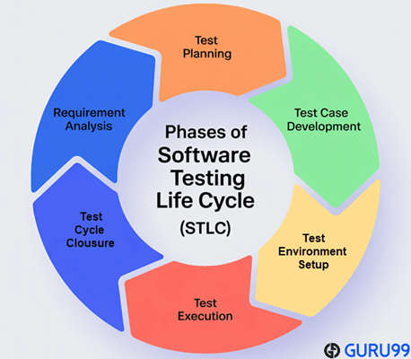
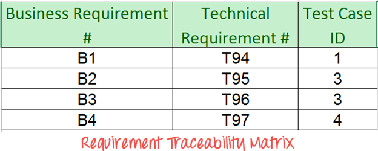

# Day 3 - STLC, RTM & Testing Execution 🚀

## Overview

Today I moved beyond testing fundamentals and started learning how testing is actually organized and executed in professional environments.

The focus was on understanding the Software Testing Life Cycle (STLC), Requirement Traceability Matrix (RTM), Manual vs Automation Testing, bug tracking, and defect reporting.

---

## 🔄 Software Testing Life Cycle (STLC)

The Software Testing Life Cycle (STLC) is a structured process followed by QA teams to ensure software quality through systematic testing activities.

### Why STLC Matters

* Provides a structured testing approach
* Improves test coverage
* Ensures requirements are validated
* Helps maintain consistency throughout the testing process
* Reduces the risk of missed defects

### STLC Phases

#### 1. Requirement Analysis

The testing team reviews and analyzes project requirements to identify testable conditions.

Activities:

* Understand business requirements
* Identify testing scope
* Clarify ambiguities

#### 2. Test Planning

Defines the testing strategy and overall approach.

Activities:

* Define objectives
* Estimate effort
* Allocate resources
* Select testing tools

#### 3. Test Case Development

Creation of test scenarios and test cases.

Activities:

* Write test cases
* Prepare test data
* Review test artifacts

#### 4. Environment Setup

Prepare the testing environment.

Activities:

* Configure software and hardware
* Verify environment readiness

#### 5. Test Execution

Execute test cases and identify defects.

Activities:

* Run tests
* Record results
* Log defects

#### 6. Test Cycle Closure

Evaluate testing outcomes and prepare reports.

Activities:

* Analyze test results
* Document lessons learned
* Prepare closure reports

### Key Concept

Every STLC phase contains:

* Entry Criteria
* Exit Criteria

These serve as quality gates before moving to the next phase.

---

## 📋 Requirement Traceability Matrix (RTM)

### What is RTM?

The Requirement Traceability Matrix (RTM) is a document that maps requirements to corresponding test cases.

### Purpose

* Ensure all requirements are tested
* Track testing progress
* Identify missing test coverage
* Improve requirement visibility

### Simple Example

### Benefits

* Complete requirement coverage
* Easier impact analysis
* Better project tracking
* Improved audit readiness

---

## ⚖️ Manual Testing vs Automation Testing

Both approaches are important and complement each other.

### Manual Testing

Manual testing is performed by human testers without automated scripts.

#### Best For

* Exploratory Testing
* Usability Testing
* User Experience Evaluation
* Ad-hoc Testing

#### Advantages

* Human intuition
* Flexibility
* Better user perspective

---

### Automation Testing

Automation testing uses scripts and tools to execute tests automatically.

#### Best For

* Regression Testing
* Repetitive Tasks
* Large Test Suites
* Performance Testing

#### Advantages

* Faster execution
* Improved consistency
* Better scalability
* Reduced repetitive effort

---

### Key Insight

Automation does not replace testers.

Human judgment remains essential for evaluating usability, user experience, and unexpected behaviors that automated scripts may miss.

---

## 🐞 Zoho BugTracker

### What is Zoho BugTracker?

Zoho BugTracker is a defect management tool used to record, track, and monitor software issues throughout the development lifecycle.

### Main Uses

* Defect tracking
* Team collaboration
* Progress monitoring
* Project visibility

### Benefits

* Centralized issue management
* Improved communication between testers and developers
* Better project transparency

---

## 📝 Anatomy of a Bug Report

A good bug report should provide enough information for developers to reproduce and fix the issue.

### Essential Components

#### Title

A clear and concise description of the issue.

#### Steps to Reproduce

Detailed actions required to trigger the defect.

#### Expected Result

What should happen according to requirements.

#### Actual Result

What actually happens.

#### Severity

The impact of the issue on the application.

### Example

Title:
Login button does not respond after entering valid credentials

Steps:

1. Open Login Page
2. Enter valid username and password
3. Click Login

Expected Result:

User should be redirected to the dashboard.

Actual Result:

Nothing happens after clicking Login.

Severity:

High

---

## ✨ Key Takeaways

1. STLC provides a structured framework for testing activities.
2. Every testing phase has specific goals and deliverables.
3. RTM helps ensure complete requirement coverage.
4. Manual and Automation Testing serve different purposes.
5. Automation improves efficiency but cannot replace human judgment.
6. Effective bug reporting is a critical QA skill.
7. Defect tracking tools help teams collaborate and maintain quality.

---

## 💭 Personal Reflection

Coming from a Front-End Development background, I usually think about creating features and making them work.

Today's learning shifted my focus toward understanding how quality is managed throughout the entire testing process.

The STLC showed me that testing is not just about finding bugs—it's a structured discipline with planning, execution, documentation, and continuous improvement.

Learning about RTM and defect tracking also helped me understand how QA teams ensure that every requirement is verified and nothing is overlooked.

This was the first day where I started seeing how all the pieces of the QA process connect together.

---

## Challenge Progress

**Series:** Breaking Into QA ✨

**Challenge:** 30-Day QA Learning Challenge

**Day Completed:** Day 3/30 ✅
