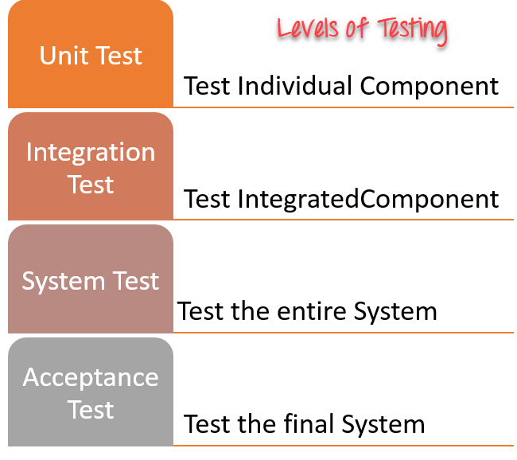
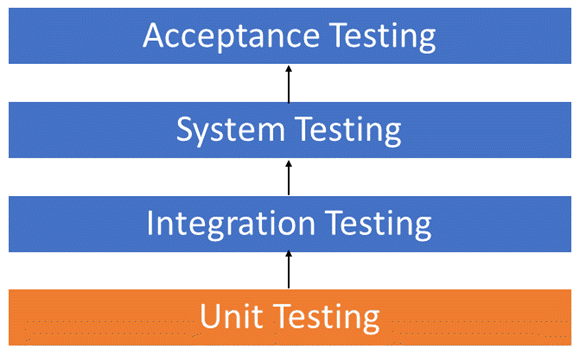
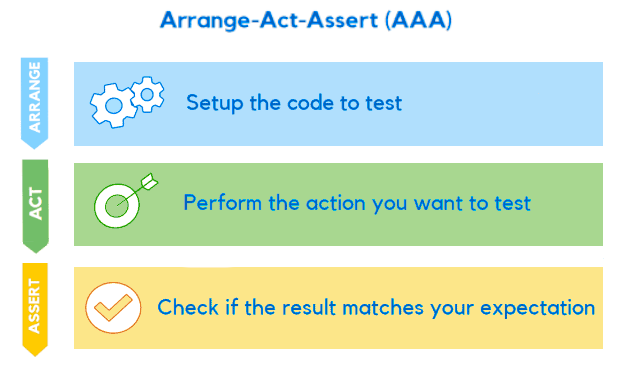
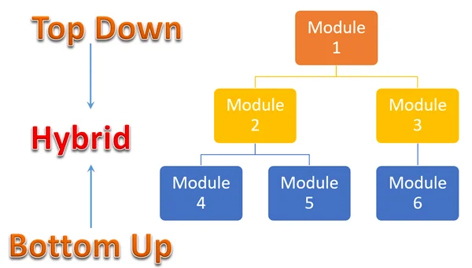
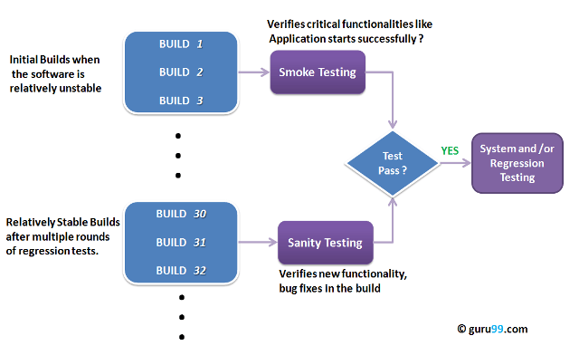
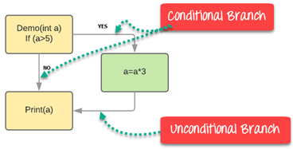

# Day 4 - Testing Levels, Smoke & Sanity Testing 🚀

## Overview

Today I moved deeper into the software testing process and learned how quality is validated at different stages of development.

The focus was on understanding software builds, testing levels, integration strategies, specialized gatekeeper testing techniques, and code coverage metrics.

These concepts showed me how testing evolves from validating individual pieces of code to verifying complete business workflows.

---

## 🏗️ The Software Build

### What is a Software Build?

A software build is the process of converting source code files into an executable application.

In professional QA environments, receiving a new build is often the trigger for testing activities to begin.

If a build is unstable or fails critical checks, it can be rejected and returned to developers for correction.

### Why Builds Matter

* Testing cannot begin without a deployable build.
* Build quality directly affects testing efficiency.
* Unstable builds waste QA effort and resources.

Suggested:
Build Process Diagram

Source Code → Build Process → Executable Application → QA Testing

---

## 🧪 The Testing Hierarchy

Testing follows a structured hierarchy where each level validates a different aspect of software quality.

### Testing Levels

1. Unit Testing
2. Integration Testing
3. System Testing
4. Acceptance Testing

### Unit Testing

Validates individual functions, methods, or classes in isolation.

### Integration Testing

Validates communication between integrated modules.

### System Testing

Evaluates the complete integrated application.

### Acceptance Testing

Final validation performed by users or stakeholders to ensure business requirements are met.

Suggested:
Testing Pyramid or Testing Hierarchy Diagram

Unit Testing
↓
Integration Testing
↓
System Testing
↓
Acceptance Testing

---

## 🔍 Unit Testing: The Foundation

Unit Testing focuses on verifying the smallest testable parts of an application.

The goal is to ensure each component behaves correctly before integration occurs.

### The AAA Pattern

A common structure used when creating unit tests.

#### Arrange

Prepare the test environment and required data.

#### Act

Execute the functionality being tested.

#### Assert

Verify that the result matches expectations.

### Test Isolation Tools

#### Stub

Provides predefined dummy data during testing.

Example:

A payment service expects customer data from a database.

Instead of accessing the real database, a Stub returns fake customer information.

#### Mock

Simulates behavior and verifies interactions.

Example:

Confirming whether an email notification was sent after registration.

### Why Isolation Matters

* Faster testing
* More reliable results
* Independence from external systems
* Easier defect identification

---

## 🔗 Integration Testing

Integration Testing verifies how different modules interact after being combined.

Even if individual modules work correctly, communication failures can occur when they are connected.

### Common Defects Found

* Data transfer issues
* API communication failures
* Incorrect interface behavior
* Data format mismatches

### Integration Strategies

#### Big Bang Integration

All modules are integrated at once and tested together.

##### Advantages

* Simple setup

##### Disadvantages

* Difficult defect isolation
* High debugging complexity

---

#### Incremental Integration

Modules are integrated gradually.

Types include:

##### Top-Down

Testing begins with higher-level modules.

Uses Stubs for lower modules that are not yet available.

##### Bottom-Up

Testing begins with lower-level modules.

Uses Drivers for higher modules that are not yet available.

##### Sandwich (Hybrid)

Combines both Top-Down and Bottom-Up approaches.

### Integration Test Doubles

| Component        | Use Stub            | Use Driver           |
| :--------------- | :------------------ | :------------------- |
| Testing Approach | Top-Down            | Bottom-Up            |
| Replaces         | Lower-Level Modules | Higher-Level Modules |
| Function         | Returns Dummy Data  | Sends Test Data      |

---

## 🚦 Smoke Testing vs Sanity Testing

These testing techniques act as quality filters before extensive testing begins.

### Smoke Testing

A broad and shallow test that validates critical application functionality.

Examples:

* Application launches successfully
* User can log in
* Main pages load correctly

### Purpose

Determine whether the build is stable enough for further testing.

---

### Sanity Testing

A focused and targeted test performed after small changes or bug fixes.

Examples:

* Verify a corrected login bug
* Verify a modified payment calculation

### Purpose

Determine whether the specific change works as expected.

### Smoke vs Sanity Comparison

| Aspect       | Smoke Testing          | Sanity Testing         |
| :----------- | :--------------------- | :--------------------- |
| Primary Goal | Verify Build Stability | Verify Specific Change |
| Scope        | Broad                  | Narrow                 |
| Depth        | Shallow                | Deep                   |
| Build State  | Initial / Unstable     | Relatively Stable      |

---

## 📊 Code Coverage

### What is Code Coverage?

Code Coverage is a White-Box Testing metric that measures how much source code is exercised by tests.

It helps teams understand the effectiveness of their test suites.

### Statement Coverage

Verifies that every executable line of code has been executed at least once.

### Branch Coverage

Verifies that every decision outcome is tested.

Example:

If (Age >= 18)

Both outcomes must be tested:

* True
* False

### Benefits

* Identifies untested code
* Improves test quality
* Reduces hidden defects

---

## 🔻 The Testing Funnel

A useful way to visualize testing activities.

### Funnel Flow

1. Smoke Testing
2. Sanity Testing
3. Regression Testing

The funnel gradually narrows from broad validation to more targeted verification.

### Why It Matters

This approach prevents teams from wasting time performing extensive testing on unstable builds.

---

## ✨ Key Takeaways

1. A software build is the starting point for QA activities.
2. Testing progresses through Unit, Integration, System, and Acceptance levels.
3. Unit Testing validates components in isolation using techniques like AAA.
4. Stubs and Mocks help isolate dependencies during testing.
5. Integration Testing verifies communication between modules.
6. Smoke Testing validates build stability.
7. Sanity Testing validates specific fixes or changes.
8. Code Coverage helps measure testing effectiveness.
9. Testing funnels help prioritize testing efforts efficiently.

---

## 💭 Personal Reflection

Coming from a Front-End Development background, I often focused on whether a feature worked from the user's perspective.

Today helped me understand how quality is built progressively throughout the software development process.

Learning about Unit Testing and Integration Testing showed me that defects can be prevented much earlier than I previously realized.

The distinction between Smoke Testing and Sanity Testing was especially valuable because it demonstrated how QA teams avoid wasting time testing unstable software.

I also found Code Coverage interesting because it provides a measurable way to evaluate how thoroughly software has been tested.

This was the first day where I started seeing testing not only as validation, but also as a strategy for reducing risk throughout development.

---

## Challenge Progress

**Series:** Breaking Into QA ✨

**Challenge:** 30-Day QA Learning Challenge

**Day Completed:** Day 4/30 ✅

---
