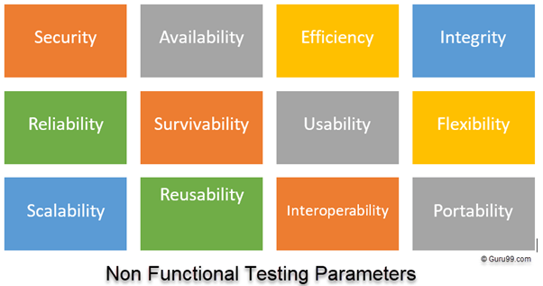
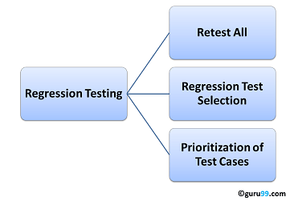

[← Back to Home](../index.md)

---

# Day 5 - Test Documentation, Techniques & Quality Reporting 🚀

## Overview

On Day 5, the focus shifted from foundational QA concepts to **formal test documentation**, **test design structure**, and **professional reporting practices** used in real QA teams.

The goal was to understand how testing is structured, documented, and communicated to stakeholders in a production environment.

---

## 📄 Test Documentation: The Formal QA Framework

In professional QA environments, testing is a **fully documented process** that ensures traceability, consistency, and accountability.

Documentation typically consumes **30%–50% of total QA effort**.

### Key Testing Documents

| Document Type                         | Description                                                     |
| :------------------------------------ | :-------------------------------------------------------------- |
| Test Policy                           | High-level QA principles and organizational testing standards   |
| Test Plan                             | Full testing strategy, scope, resources, schedule, and approach |
| RTM (Requirement Traceability Matrix) | Maps requirements to test cases for full coverage               |
| Test Scenario                         | High-level validation of what needs to be tested                |
| Test Case                             | Step-by-step instructions to validate a scenario                |
| Test Summary Report                   | Final report used for release decisions                         |

---

## 🔄 Test Scenarios vs Test Cases

Understanding the relationship between scenarios and test cases is essential for structured QA design.

* **Test Scenario:** High-level idea of what to test (user journey or feature)
* **Test Case:** Detailed execution steps to validate the scenario

### Analogy

A **Test Scenario = Chapter Title**
A **Test Case = Full Paragraph explaining the chapter**

---

## 🧪 Writing Professional Test Cases

A strong test case must be **clear, reusable, and executable by any tester without clarification**.

### Test Case Structure

1. Test Case ID (e.g., TC_LOGIN_01)
2. Priority (High / Medium / Low)
3. Preconditions
4. Test Steps
5. Test Data
6. Expected Result
7. Actual Result
8. Status (Pass / Fail / Blocked)

### Example Test Case

| ID   | Description | Test Data              | Expected Result           | Actual Result             | Status |
| :--- | :---------- | :--------------------- | :------------------------ | :------------------------ | :----- |
| TC-1 | Valid Login | user=Guru99, pass=1234 | User logs in successfully | User logs in successfully | Pass   |

---

## ⚙️ Non-Functional Testing

Non-functional testing evaluates **how the system behaves**, not what it does.

### Key Areas

* Security: Protection against threats
* Reliability: Stability over time
* Usability: Ease of use
* Scalability: Handling increased load
* Performance: Speed and responsiveness (e.g., < 5s load time)

---

## 🔁 Regression Testing

Regression testing ensures that **new changes do not break existing functionality**.

### When it is performed

* After new features are added
* After bug fixes
* After system integration updates

### Purpose

* Maintain system stability
* Detect unintended side effects
* Ensure existing features remain intact

---

## 🐞 Reporting in QA 😢

Reporting is the **evidence layer** of QA work and supports release decisions.

### 1. Bug Report

A structured document describing a defect.

Must include:

* Steps to reproduce
* Severity / Priority
* Expected vs Actual result
* Evidence (screenshots/videos)

### 2. Test Summary Report

Final QA document used for release decisions.

Includes:

* Execution results
* Pass/Fail metrics
* Defect density
* Overall test coverage

---

## 📊 Key QA Insight

QA is not only about finding defects but about:

* Structuring test information
* Ensuring traceability
* Providing measurable evidence
* Supporting release decisions with data

---

## ✨ Key Takeaways

1. Test documentation is essential for structured QA workflows
2. Scenarios define what to test; test cases define how to test
3. Strong test cases must be clear and reusable
4. Non-functional testing focuses on system behavior under conditions
5. Regression testing protects existing functionality
6. QA reporting provides evidence for release decisions

---

## 💭 Personal Reflection

This stage of learning makes QA feel more structured and analytical.

Instead of only thinking about whether something works, the focus expands to how it is documented, verified, and communicated across teams.

Understanding documentation, test design, and reporting shows how QA acts as a **bridge between development and business decisions**, ensuring quality is measurable and traceable.

---

## Challenge Progress

**Challenge:** 30-Day QA Learning Challenge

**Day Completed:** Day 5 ✅

---

[← Previous: Day 4](./04-testing-levels.md) | [← Back to Home](../index.md) | [Next: Day 6 →](./06-test-analysis-rtm-test-data.md)