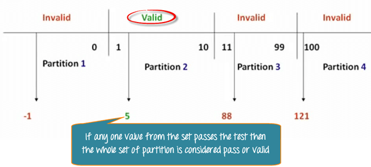
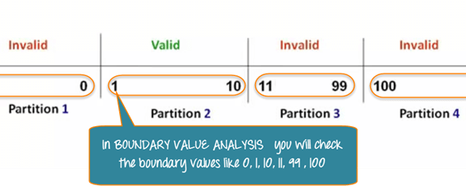
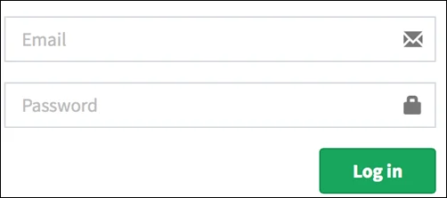
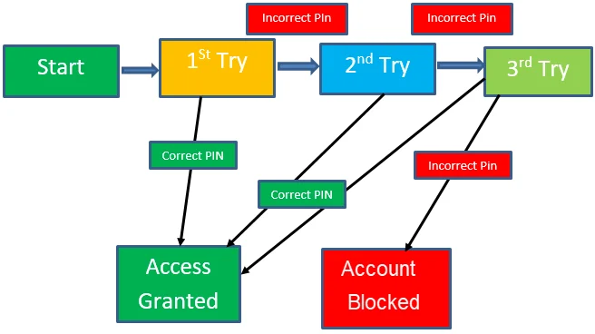

# Day 7 - Black-Box Testing Techniques & Strategic Test Design 🚀

## Overview

On Day 7, the focus shifted to **strategic test case design**, moving from process understanding to structured techniques used to maximize test coverage efficiently.

This phase introduces **Black-Box Testing Techniques**, which help design tests based on input/output behavior without considering internal code structure.

---

## ⚫ Black-Box Testing Techniques

Black-box techniques focus on **what the system does**, not how it is implemented.

They improve:

* Coverage
* Efficiency
* Defect detection
* Test design consistency

---

## 1. 🔢 Equivalence Partitioning (EP) 

Equivalence Partitioning divides input data into **valid and invalid groups**, where only one value per group is tested.

### Core Idea

If one value in a group works (or fails), others in the same group behave similarly.

### Example (Range 1–10)

* Invalid: ≤ 0
* Valid: 1–10
* Invalid: ≥ 11

### Key Benefit

Reduces number of test cases while maintaining coverage.

---

## 2. 📏 Boundary Value Analysis (BVA) 

BVA focuses on testing **edge values**, where defects are most likely to occur.

### Five-Point Strategy

* Minimum - 1
* Minimum
* Nominal (middle)
* Maximum
* Maximum + 1

### Example (Range 1–10)

| Scenario       | Input | Expected Result | Technique |
| :------------- | :---: | :-------------- | :-------- |
| Below Boundary |   0   | Reject          | BVA       |
| Lower Boundary |   1   | Accept          | BVA       |
| Nominal        |   5   | Accept          | EP        |
| Upper Boundary |   10  | Accept          | BVA       |
| Above Boundary |   11  | Reject          | BVA       |

---

## 3. 🧠 Decision Table Testing 

Decision Tables are used when multiple conditions affect outcomes.

### Core Concept

Each combination of conditions produces a rule.

Formula:

* Number of rules = **2ⁿ**

(where n = number of boolean conditions)

### Example: Login System

The condition is simple: if the user provides the correct username and password, they are redirected to the homepage. If any input is wrong, an error message is displayed.

| Conditions        | Rule 1 | Rule 2 | Rule 3 |  Rule 4 |
| :---------------- | :----: | :----: | :----: | :-----: |
| Username Correct? |    F   |    T   |    F   |    T    |
| Password Correct? |    F   |    F   |    T   |    T    |
| Result            |  Error |  Error |  Error | Success |

---

## 4. 🔄 State Transition Testing 

State Transition Testing validates how a system behaves as it moves between **different states over time**.

### Core Elements

* States
* Events
* Transitions
* Actions

### Example: ATM PIN Lock System

| State       | Correct PIN    | Incorrect PIN   |
| :---------- | :------------- | :-------------- |
| Start       | Access Granted | 1st Attempt     |
| 1st Attempt | Access Granted | 2nd Attempt     |
| 2nd Attempt | Access Granted | 3rd Attempt     |
| 3rd Attempt | Access Granted | Account Blocked |

---

## 5. 👤 Use Case Testing 😢

Use Case Testing validates **end-to-end user interactions** with the system.

### Structure

* Actor (User)
* System
* Precondition
* Main Flow (Happy Path)
* Extensions (Errors/Exceptions)

### Example: Login Flow

| Step  |  Interaction  | Description                  |
| :---- | :-----------: | :--------------------------- |
| 1     | User → System | Enter username and password  |
| 2     |     System    | Validate credentials         |
| 3     |     System    | Grant access                 |
| Ext 1 |     System    | Invalid credentials message  |
| Ext 2 |     System    | Lock after multiple failures |

---

## 4. 🔄 State Transition Testing 

State Transition Testing validates how a system behaves as it moves between **different states over time**.

### Core Elements

* States
* Events
* Transitions
* Actions

### Example: ATM PIN Lock System

### Typical Targets

* Special characters
* Empty inputs
* Unexpected formats
* Known weak areas in systems

### Key Advantage

Finds hidden or overlooked defects that structured methods may miss.

---

## 🧠 Key QA Insight

Day 7 introduces a shift toward **optimized test design**, where the goal is no longer just understanding testing, but designing tests that are:

* Minimal
* Strategic
* High coverage
* High defect detection efficiency

---

## ✨ Key Takeaways

1. Black-box testing focuses on system behavior, not code
2. Equivalence Partitioning reduces redundant tests
3. Boundary Value Analysis targets high-risk edge cases
4. Decision tables handle complex logic combinations
5. State transition testing models system behavior over time
6. Use cases validate full user journeys
7. Error guessing relies on experience and intuition

---

## 💭 Personal Reflection

This stage introduces a more **engineering-driven approach to testing design**.

Instead of creating test cases manually without structure, QA becomes a **systematic process of selecting the most effective test inputs** using proven techniques.

It highlights how professional testers think in terms of **coverage optimization and defect probability**, not just execution.

---

## Challenge Progress

**Series:** Breaking Into QA ✨

**Challenge:** 30-Day QA Learning Challenge

**Day Completed:** Day 7/30 ✅

---
